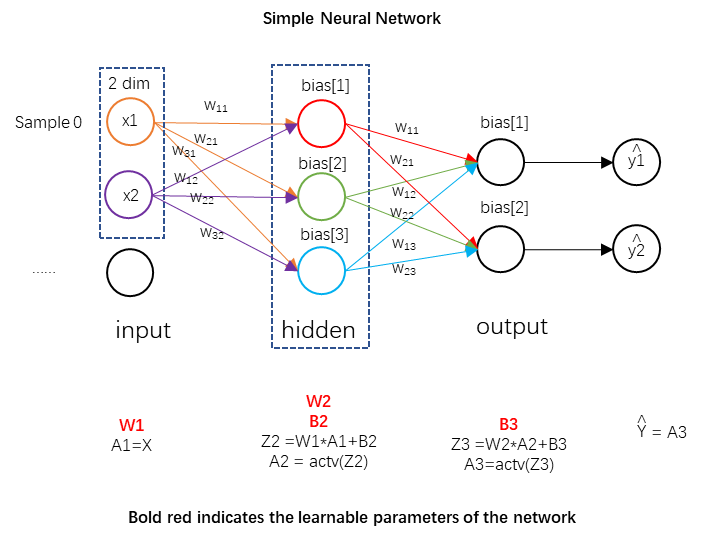
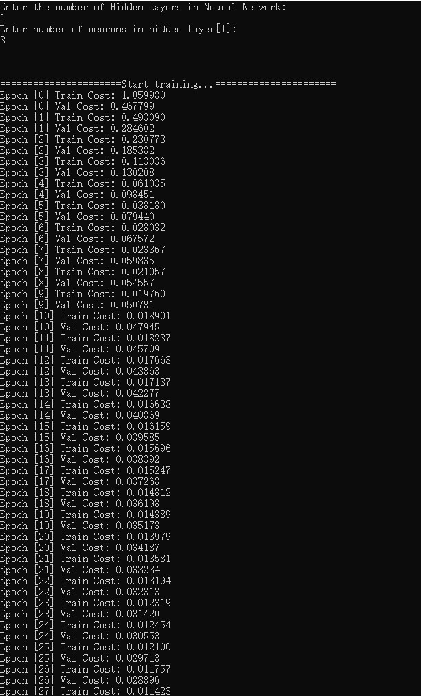
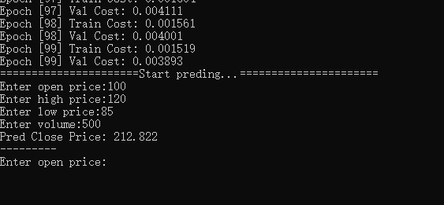

## A simple neural network based on - stock price prediction as an example(C++/C)

## 1. Main Modules

- `Neuron.h`：Used to declare neuron class and constructors
- `Layer.h`：Used to declare network layer class and constructors
- `NNet.h`：Used to declare neural network class and construct and initialize functions
- `Dataset.h`：Used to declare dataset class and constructors
- `Trainer.h`：Used to declare the forward and backward propagation class and related functions of neural networks

## 2. Understand Network Structure and Parameters

The above figure shows a 3-layer simple neural network with 2D input and 1D output. w and bias are the learning parameters of the network. The specific calculation process is as follows:

**Forward propagation**

(Input Layer - Hidden Layer)

input

$$
A_1=X=[x_1,x_2]
$$

Weights

$$
W_1 = \begin{bmatrix} w_{11}^{(1)} & w_{12}^{(1)} \\\\\\\\ w_{21}^{(1)} & w_{22}^{(1)} \\\\\\\\ w_{31}^{(1)} & w_{32}^{(1)} \end{bmatrix}
$$

Biases

$$
B_2 = \begin{bmatrix} b_1^{(2)} \\\\\\\\ b_2^{(2)} \\\\\\\\ b_3^{(2)} \end{bmatrix}
$$

Weighted Sum

$$
Z_2 = W_1 \cdot A_1^T + B_2 = \begin{bmatrix} w_{11}^{(1)}a_1^{(1)} + w_{12}^{(1)}a_2^{(1)} + b_1^{(2)} \\\\\\\\ w_{21}^{(1)}a_1^{(1)} + w_{22}^{(1)}a_2^{(1)} + b_2^{(2)} \\\\\\\\ w_{31}^{(1)}a_1^{(1)} + w_{32}^{(1)}a_2^{(1)} + b_3^{(2)} \end{bmatrix}
$$

Activate (ReLU or Sigmoid)

$$
A_2 = \sigma(Z_2) = \begin{bmatrix} \sigma(z_1) \\\\\\\\ \sigma(z_2) \\\\\\\\ \sigma(z_3) \end{bmatrix} = \begin{bmatrix} a_1^{(2)} \\\\\\\\ a_2^{(2)} \\\\\\\\ a_3^{(2)} \end{bmatrix}
$$

(Hidden layer - Output layer)

Weights

$$
W_2 = \begin{bmatrix} w_{11}^{(2)} & w_{12}^{(2)} & w_{13}^{(2)} \\\\\\\\ w_{21}^{(2)} & w_{22}^{(2)} & w_{23}^{(2)} \end{bmatrix}
$$

Biases

$$
B_3 = \begin{bmatrix} b_1^{(3)} \\\\\\\\ b_2^{(3)} \end{bmatrix}
$$

Weighted Sum

$$
Z_3 = W_2 \cdot A_2 + B_3 =\begin{bmatrix} w_{11}^{(2)}a_{1}^{(2)} + w_{12}^{(2)}a_{2}^{(2)} + w_{13}^{(2)}a_{3}^{(2)} + b_1^{(3)} \\\\\\\\ w_{21}^{(2)}a_{1}^{(2)} + w_{22}^{(2)}a_{2}^{(2)} + w_{23}^{(2)}a_{3}^{(2)} + b_2^{(3)} \end{bmatrix}
$$

Activate (Sigmoid)

$$
\hat{Y} = A_3 =\sigma(Z_3) =\begin{bmatrix} \hat{y_1} \\\\\\\\ \hat{y_2} \end{bmatrix}
$$

> NOTE: When solving regression problems,  $A3=Z_3$ 

Calculate loss (assuming the Mean Squared Error (MSE) loss function or Cross Entropy Loss function is used)

$$
{MSE}\_\text{Loss} = \frac{1}{2m} \sum_{i=1}^m (\hat{y_i} - y_i)^2 \\
or \\
{CE}\_\text{Loss}= -\frac{1}{m} \sum_{i=1}^m \left[ y_i \log(\hat{y}_i) + (1 - y_i) \log(1 - \hat{y}_i) \right]
$$

**Backward propagation**

(Output Layer - Hidden Layer)

Calculate gradients and update weights and biases. Among them, $\alpha$ is the learning rate.

$$
\delta^{(3)} = \frac{\partial \text{Loss}}{\partial Z_3} = (\hat{Y} - Y) = A_3 - Y = \begin{bmatrix} \delta_1^{(3)}  \\\\\\\\ \delta_2^{(3)}  \end{bmatrix} 
$$

$$
W_2 = W_2 - \alpha \cdot \frac{\partial \text{Loss}}{\partial W_2} = W2 - \alpha \cdot \frac{\partial \text{Loss}}{\partial Z_3} \cdot \frac{\partial Z_3}{\partial W_2}  = W2 - \alpha \cdot \delta^{(3)} \cdot \mathbf{A_2}^T  = \begin{bmatrix} w_{11}^{(2)} - \alpha \delta_1^{(3)}a_1^{(2)} & w_{12}^{(2)} - \alpha \delta_1^{(3)}a_2^{(2)} & w_{13}^{(2)} - \alpha \delta_1^{(3)}a_3^{(2)} \\\\\\\\ w_{21}^{(2)} - \alpha \delta_2^{(3)}a_1^{(2)} & w_{22}^{(2)} - \alpha \delta_2^{(3)}a_2^{(2)} & w_{23}^{(2)} - \alpha \delta_2^{(3)}a_3^{(2)} \end{bmatrix} 
$$

$$
B_3 = B_3 - \alpha \cdot \frac{\partial \text{Loss}}{\partial B_3}=B_3 - \alpha \cdot \frac{\partial \text{Loss}}{\partial Z_3}\cdot \frac{\partial Z_3}{\partial B_3} = B3 - \alpha \cdot \delta^{(3)} = \begin{bmatrix} b_1^{(3)} - \alpha \delta_1^{(3)} \\\\\\\\ b_2^{(3)} - \alpha \delta_2^{(3)} \end{bmatrix}
$$

> MSE Loss function gradient, usually not use activation function:
>
>
> $$
> \frac{\partial \text{L}}{\partial z} = \frac{\partial \text{L}}{\partial \hat{y}_i} = \hat{y_i} - y_i
> $$
>
> Cross Entropy Loss function gradient (log x=ln x), usually using sigmoid activation function:
>
>
> $$
> \frac{\partial L}{\partial \hat{y}_i} = - \left( \frac{y_i}{\hat{y}_i} - \frac{1 - y_i}{1 - \hat{y}_i} \right) 
> $$
> $$
> \frac{\partial L}{\partial z} = \frac{\partial L}{\partial \hat{y}_i} \cdot \frac{\partial \hat{y}_i}{\partial z} 
> $$
> $$
> \frac{\partial L}{\partial z} = - \left( \frac{y_i}{\hat{y}_i} - \frac{1 - y_i}{1 - \hat{y}_i} \right) \cdot \hat{y}_i (1 - \hat{y}_i) 
> $$
> $$
> \frac{\partial L}{\partial z} = \hat{y}_i - y_i
> $$
>
> Sigmoid Activation function gradient:
>
>
> $$
> \sigma(x) = \frac{1}{1 + e^{-x}} = (1 + e^{-x})^{-1} \\
> \sigma'(x) = - (1 + e^{-x})^{-2} \cdot (-e^{-x}) = \frac{e^{-x}}{(1 + e^{-x})^2}=\sigma(x) \odot (1 - \sigma(x))
> $$

(Hidden Layer - Input Layer)

Calculate gradients and update weights and biases, assuming the use of sigmoid activation function.

$$
\delta^{(2)} = \frac{\partial \text{Loss}}{\partial Z_2} = \frac{\partial \text{Loss}}{\partial Z_3} \cdot \frac{\partial Z_3}{\partial A_2} \cdot \frac{\partial A_2}{\partial Z_2} = (\delta_3 \cdot \mathbf{W_2}^T) \odot \sigma'(\mathbf{Z_2})=\begin{bmatrix} (w_{11}^{(2)}\delta_1^{(3)} + w_{21}^{(2)}\delta_2^{(3)})z_1^{(2)}(1-z_1^{(2)}) \\\\\\\\ (w_{12}^{(2)}\delta_1^{(3)} + w_{22}^{(2)}\delta_2^{(3)})z_2^{(2)}(1-z_2^{(2)})  \\\\\\\\ (w_{13}^{(2)}\delta_1^{(3)} + w_{23}^{(2)}\delta_2^{(3)})z_3^{(2)}(1-z_3^{(2)})  \end{bmatrix} = \begin{bmatrix} \delta_1^{(2)} \\\\\\\\ \delta_2^{(2)} \\\\\\\\ \delta_3^{(2)} \end{bmatrix} 
$$

$$
W_1 := W_1 - \alpha \cdot \frac{\partial Loss}{\partial W_1}=W_1 - \alpha \cdot \frac{\partial \text{Loss}}{\partial Z_2} \cdot \frac{\partial Z_2}{\partial W_1} = W_1 - \alpha \cdot \delta^{(2)} \cdot \mathbf{A1}=\begin{bmatrix} w_{11}^{(1)}-\alpha\delta_1^{(2)}a_1^{(1)} & w_{12}^{(1)}-\alpha\delta_1^{(2)}a_2^{(1)} \\\\\\\\ w_{21}^{(1)}-\alpha\delta_2^{(2)}a_1^{(1)} & w_{22}^{(1)}-\alpha\delta_2^{(2)}a_2^{(1)} \\\\\\\\ w_{31}^{(1)}-\alpha\delta_3^{(2)}a_1^{(1)} & w_{32}^{(1)}-\alpha\delta_3^{(2)}a_2^{(1)}\end{bmatrix} 
$$

$$
B_2 := B_2 - \alpha \cdot \frac{\partial Loss}{\partial B_2}=B2-\alpha \cdot\delta^{(2)}
$$

## Stock Price Prediction 

> - `stock_price_data.txt` contains 100 simulated stock price prediction training data, each row including date, date timestamp, opening price (Open), high price (High), low price (Low), closing price (Close), and trading volume (Volume)
>
> - Here, stock price prediction is viewed as a pure regression problem, with inputs of 4 dimensions (Open, High, Low, Volume) and outputs of 1 dimension (Close)

Build a 3-layer neural network with 3 hidden layer neurons
The training results are shown in the figure:

The test results are shown in the figure:

